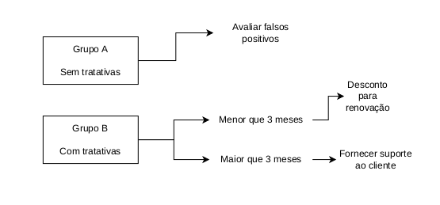
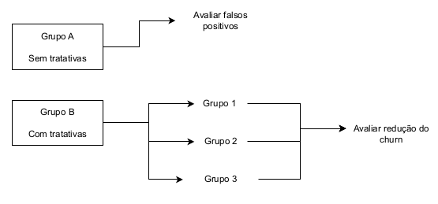

# Efeito do modelo 

## Primeiro experimento 

Para o primeiro experimento, podemos escolher quais tratativas, quando e para quais clientes elas serão direcionadas.
Dessa forma, podemos dividir os clientes com previsão de churn em dois grupos: Grupo A que não recebe as tratativas e Grupo B que recebe tratativas. Nessa primeira parte podemos comparar se a média de churns que ocorreram no grupo A é estatísticamente diferente da média de churns no grupo B. Se sim, isso significa que as tratativas tiverem efeito  em afetar o churn. Em seguida, para avaliar nosso modelo podemos verificar se a quantidade de falsos positivos foi baixa no
grupo A (menor ou igual a 20% conforme dados de análise do modelo). Se sim, isso significa que nosso modelo está preciso.

Já para o Grupo B podemos ter dentro dele duas tratativas: para clientes menor que três meses de permanência podemos oferecer descontos na utilização de produtos caso exista renovação de contrato e para clientes maiores que três meses de permanência podemos oferecer um melhor suporte ao cliente, fornecendo conteúdos sobre a utilização da plataforma que podem ser úteis ao negócio. Dessa forma, queremos que a quantidade de clientes que realizam churn seja baixa e se possível cerca de 20% menor que a previsto, pois isso, supera as perdas prevista pelo modelo.

## Segundo experimento

No segundo experimento quem decide a tratativa e quais clientes as vão receber é da área de negócio. Dessa forma, temos três tratativas para lidar com o churn, ou seja, três grupos para direcionar recursos e reverter o quadro (Grupo 1, Grupo 2 e Grupo 3).
Sendo assim, para avaliar se o modelo é preciso, podemos seguir a ideia do projeto anterior de dentro dos grupos separar os clientes que o modelo previu o churn e não vão receber a tratativa dos que vão receber a tratativa. Dessa forma, dentro do grupo que não recebeu tratativas, queremos que o modelo preveja poucos falsos positivos. 

Já para os clientes que receberam tratativas, podemos avaliar a redução de churn que tivermos. Se isso for menor do que 20% podemos dizer que as tratativas superaram as perdas por desligamento prevista pelo modelo.

